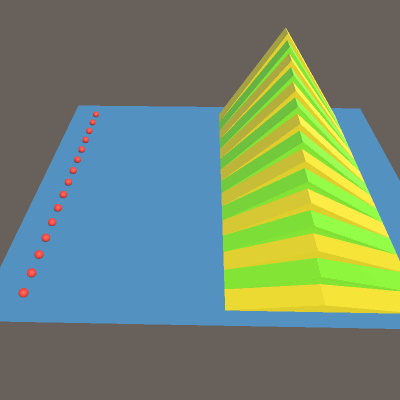
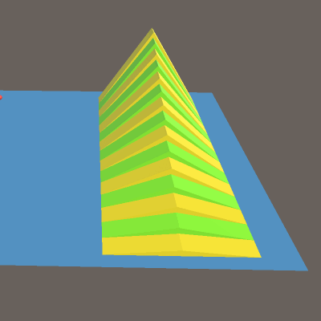
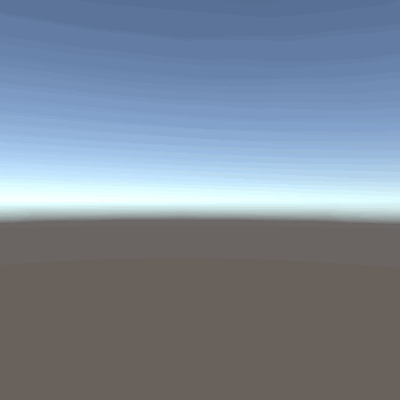
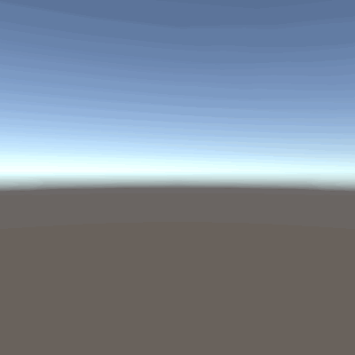
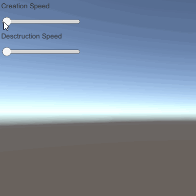

# Catlike Coding Tutorials for Unity
Projects made with [Cat Like Coding tutorials](https://catlikecoding.com/unity/tutorials/) to learn Unity

## Tutorials Completed

### Basics

#### Simple Clock: [Code](Simple%20Clock) | [Tutorial - Game Objects and Scripts](https://catlikecoding.com/unity/tutorials/basics/game-objects-and-scripts/)

- [X] Build a clock with simple objects.
- [X] Write a C# script.
- [X] Rotate the clock's arms to show the time.
- [X] Animate the arms.

#### Visualizing Math: [Code](Visualizing%20Math) | [Tutorial - Building a Graph](https://catlikecoding.com/unity/tutorials/basics/building-a-graph/)

- Create a prefab.
- Instantiate a line of cubes.
- Show a mathematical function.
- Create a custom shader.
- Make the graph move.

#### Sculpting with Numbers: [Code](Sculpting%20with%20Numbers) | [Tutorial - Mathematical Surfaces](https://catlikecoding.com/unity/tutorials/basics/mathematical-surfaces/)

- [X] Support multiple function methods.
- [X] Use a delegate and enumeration.
- [X] Display 2D functions with a grid.
- [X] Define surfaces in 3D space.

#### Details Through Recursion: [Code](Details%20Through%20Recursion) | [Tutorial - Constructing a Fractal](https://catlikecoding.com/unity/tutorials/constructing-a-fractal/)

- [X] Instantiate game objects.
- [X] Work with recursion.
- [X] Use coroutines.
- [X] Add randomness.

#### Measuring Performance: [Code](Measuring%20Performance) | [Tutorial - Frames Per Second](https://catlikecoding.com/unity/tutorials/frames-per-second/)

- [X] Use physics to create an ever-growing atomic nucleus.
- [X] Use the profiler to investigate performance.
- [X] Measure and display the frame rate.
- [X] Prevent the creation of temporary strings.
- [X] Stabilize the frame rate by averaging multiple frames.
- [ ] Colorize the frame rate display.

### Movement 

#### Player-Controlled Motion: [Code](Player-Controlled%20Motion) | [Tutorial - Sliding a Sphere](https://catlikecoding.com/unity/tutorials/movement/sliding-a-sphere/)

- [X] Put a sphere with a trail on a plane.
- [X] Position the sphere based on player input.
- [X] Control velocity and acceleration.
- [X] Limit the sphere's position and make it bounce off edges.

#### Pushing a Sphere Around: [Code](Pushing%20a%20Sphere%20Around) | [Tutorial - Physics](https://catlikecoding.com/unity/tutorials/movement/physics/)

- [X] Control the velocity of a rigidbody sphere.
- [X] Support vertical movement via jumping.
- [X] Detect the ground and its angle.
- [X] Use a ProBuilder to create test scenes.
- [X] Move along slopes.

#### Staying in Touch: [Code](Staying%20in%20Touch) | [Tutorial - Surface Contact](https://catlikecoding.com/unity/tutorials/movement/surface-contact/)

- [X] Stick to the ground instead of launching off a ramp.
- [X] Perform a raycast.
- [X] Configure multiple layers and their interaction.
- [ ] Navigate stairs.
- [ ] Make use of steep contacts.

#### Relative Control: [Code](Relative%20Control) | [Tutorial - Orbit Camera](https://catlikecoding.com/unity/tutorials/movement/orbit-camera/)

- [X] Create an orbiting camera.
- [X] Support manual and automatic camera rotation.
- [ ] Make movement relative to the camera.
- [ ] Prevent the camera from intersecting geometry.

### Object Management

#### Creating, Saving, and Loading: [Code](Creating%2C%20Saving%2C%20and%20Loading) | [Tutorial - Persisting Objects](https://catlikecoding.com/unity/tutorials/object-management/persisting-objects/)

- [X] Spawn random cubes in response to a key press.
- [X] Use a generic type and virtual methods.
- [X] Write data to a file and read it back.
- [X] Save the game state so it can be loaded later.
- [X] Encapsulate the details of persisting data.

#### Fabricating Shapes: [Code](Fabricating%20Shapes) | [Tutorial - Object Variety](https://catlikecoding.com/unity/tutorials/object-management/object-variety/)

- [X] Create a factory for shapes.
- [X] Save and load shape identifiers.
- [X] Support multiple materials and random colors.
- [X] Enable GPU instancing.

#### Object Pools: [Code](Object%20Pools) | [Tutorial - Reusing Objects](https://catlikecoding.com/unity/tutorials/object-management/reusing-objects/)

- [X] Destroy shapes.
- [X] Automate creation and destruction.
- [X] Build a simple GUI.
- [X] Track memory allocations with the profiler.
- [X] Use objects pools to recycle shapes.

