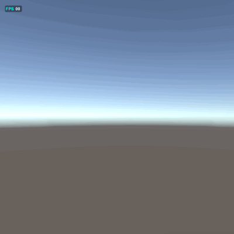

# Catlike Coding Tutorials for Unity
Projects made with [Cat Like Coding tutorials](https://catlikecoding.com/unity/tutorials/) to learn Unity

## Tutorials Completed

### Basics

#### Simple Clock: [Code](Simple%20Clock) | [Game Objects and Scripts](https://catlikecoding.com/unity/tutorials/basics/game-objects-and-scripts/)

- [X] Build a clock with simple objects.
- [X] Write a C# script.
- [X] Rotate the clock's arms to show the time.
- [X] Animate the arms.

#### Visualizing Math: [Code](Visualizing%20Math) | [Building a Graph](https://catlikecoding.com/unity/tutorials/basics/building-a-graph/)

- Create a prefab.
- Instantiate a line of cubes.
- Show a mathematical function.
- Create a custom shader.
- Make the graph move.

#### Sculpting with Numbers: [Code](Sculpting%20with%20Numbers) | [Mathematical Surfaces](https://catlikecoding.com/unity/tutorials/basics/mathematical-surfaces/)

- [X] Support multiple function methods.
- [X] Use a delegate and enumeration.
- [X] Display 2D functions with a grid.
- [X] Define surfaces in 3D space.

#### Details Through Recursion: [Code](Details%20Through%20Recursion) | [Constructing a Fractal](https://catlikecoding.com/unity/tutorials/constructing-a-fractal/)

- [X] Instantiate game objects.
- [X] Work with recursion.
- [X] Use coroutines.
- [X] Add randomness.

#### Measuring Performance: [Code](Measuring%20Performance) | [Frames Per Second](https://catlikecoding.com/unity/tutorials/frames-per-second/)

- [X] Use physics to create an ever-growing atomic nucleus.
- [X] Use the profiler to investigate performance.
- [X] Measure and display the frame rate.
- [X] Prevent the creation of temporary strings.
- [X] Stabilize the frame rate by averaging multiple frames.
- [ ] Colorize the frame rate display.

### Movement 

#### Player-Controlled Motion: [Code](Player-Controlled%20Motion) | [Sliding a Sphere](https://catlikecoding.com/unity/tutorials/movement/sliding-a-sphere/)

- [X] Put a sphere with a trail on a plane.
- [X] Position the sphere based on player input.
- [X] Control velocity and acceleration.
- [X] Limit the sphere's position and make it bounce off edges.

